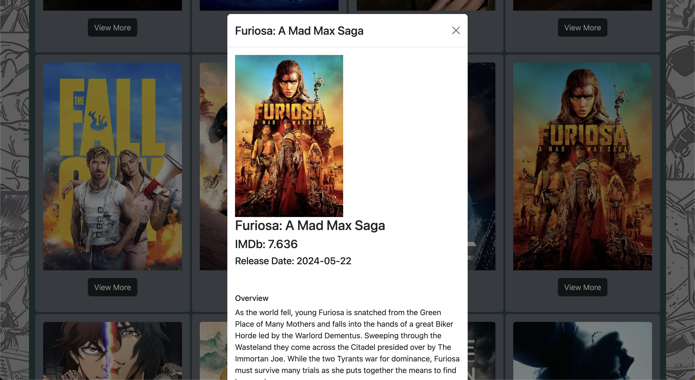

<h1>Movie Hive</h1>

<h2>About the project</h2>

  
Movie Hive is a React app using the TMDB API interacts with the movie database to fetch and display movie data.

👉 Live Demo: <a href='https://sanjayvjacob.github.io/MovieHive-react/'>Live Demo</a>

<h3>Build with:</h3>

» React, CSS3, Bootstrap 
» TMDB API

API_URL="https://api.themoviedb.org/3/movie/popular?api_key=<<api_key_here>>"

API_IMG="https://image.tmdb.org/t/p/w500/"

API_SEARCH="https://api.themoviedb.org/3/search/movie?api_key=<<api_key_here>>&query"

### Screenshot

Home page

Search Result with modal

